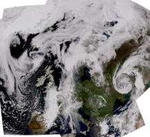
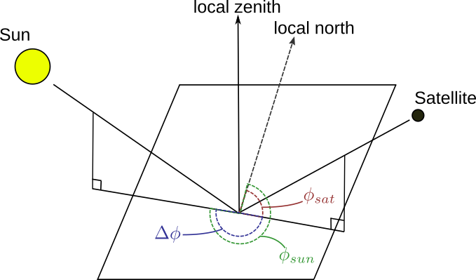

Atmospherioc correction in the visible spectrum
-----------------------------------------------

In particular at the shorter wavelengths around :math:`400-600 nm`, which
include the region used e.g. for ocean color products or true color imagery, in
particular the Rayleigh scattering due to atmospheric molecules or atoms, and
Mie scattering and absorption of aerosols, becomes significant.  As this
atmospheric scattering and absorption is obscuring the retrieval of surface
parameters and since it is strongly dependent on observation geometry, it is
custom to try to correct or subtract this unwanted signal from the data before
performing the geophysical retrieval or generating useful and nice looking
imagery.

In order to correct for this atmospheric effect we have simulated the solar
reflectance under various sun-satellite viewing conditions for a set of
different standard atmospheres, asuming a black surface, using a radiative
transfer model. For a given atmosphere the reflectance is dependent on wavelenght,
solar-zenith angle, satellite zenith angle, and the relative sun-satellite
azimuth difference angle:

.. math::

    \sigma = \sigma({\theta}_0, \theta, \phi, \lambda)

The relative sun-satellite azimuth difference angle is defined as illustrated
in the figure below:

The method is descriped in detail in a scientific paper_.

To apply the atmospheric correction for a given satellite sensor band, the
procedure involves the following three steps:

 * Find the effective wavelength of the band
 * Derive the atmospheric absorption and scattering contribution
 * Subtract that from the observations

As the Rayleigh scattering, which is the dominating part we are correcting for
under normal situations (when there is no excessive pollution or aerosols in
the line of sight) is proportional to :math:`\frac{1}{{\lambda}^4}` the
effective wavelength is derived by convolving the spectral response with
:math:`\frac{1}{{\lambda}^4}`. 

To get the atmospheric contribution for an arbitrary band, first the
solar zenith, satellite zenith and the sun-satellite azimuth difference angles
should be loaded.

For the VIIRS M2 band the interface looks like this:

  >>> from pyspectral.rayleigh import Rayleigh
  >>> viirs = Rayleigh('Suomi-NPP', 'viirs')
  >>> import numpy as np
  >>> sunz = np.array([[32., 40.], [31., 41.]])
  >>> satz = np.array([[45., 20.], [46., 21.]])
  >>> ssadiff = np.array([[110, 170], [120, 180]])
  >>> refl_cor_m2 = viirs.get_reflectance(sunz, satz, ssadiff, 'M2')
  >>> print(refl_cor_m2)
  [[ 10.45746088   9.69434733]
   [ 10.35336108   9.74561515]]

This Rayleigh (including Mie scattering and aborption by aerosols) contribution
should then of course be subtracted from the data.
Optionally the red band can be provided as the fifth argument, which will
provide a more gentle scaling in cases of high reflectances (above 20%):

  >>> redband =  np.array([[23., 19.], [24., 18.]])
  >>> refl_cor_m2 = viirs.get_reflectance(sunz, satz, ssadiff, 'M2', redband)
  >>> print(refl_cor_m2)
  [[ 10.06530609   9.69434733]
   [  9.83569303   9.74561515]]

In case you want to bypass the reading of the sensor response functions or you have
a sensor for which there are no RSR data available in PySpectral it is still possible
to derive an atmospheric correction for that band. All what is needed is the effective
wavelength of the band, given in micrometers (`:math: \mu m`). This wavelength is
normally calculated by PySPectral from the RSR data when passing the name of the band
as above.

  >>> from pyspectral.rayleigh import Rayleigh
  >>> viirs = Rayleigh('UFO', 'ufo')
  >>> import numpy as np
  >>> sunz = np.array([[32., 40.], [31., 41.]])
  >>> satz = np.array([[45., 20.], [46., 21.]])
  >>> ssadiff = np.array([[110, 170], [120, 180]])
  >>> refl_cor_m2 = viirs.get_reflectance(sunz, satz, ssadiff, 0.45, redband)
  [[ 9.55453743  9.20336915]
   [ 9.33705413  9.25222498]]

You may choose any name for the platform and sensor as you like, as long as
it does not match a platform/sensor pair for which RSR data exist in PySpectral.

At the moment we have done simulations for a set of standard atmospheres in two
different configurations, one only considering Rayleigh scattering, and one also
accounting for Aerosols. On default we use the simulations with the marine-clean
aerosol distribution and the US-standard atmosphere, but it is possible to specify
if you want another setup, e.g.:

  >>> from pyspectral.rayleigh import Rayleigh
  >>> viirs = Rayleigh('Suomi-NPP', 'viirs', atmosphere='midlatitude summer', rural_aerosol=True)
  >>> refl_cor_m2 = viirs.get_reflectance(sunz, satz, ssadiff, 'M2', redband)
  [[ 10.01281363   9.65488615]
   [  9.78070046   9.70335278]]

.. _Satpy: http://www.github.com/pytroll/satpy
.. _zenodo: https://doi.org/10.5281/zenodo.1288441
.. _paper: https://doi.org/10.3390/rs10040560

