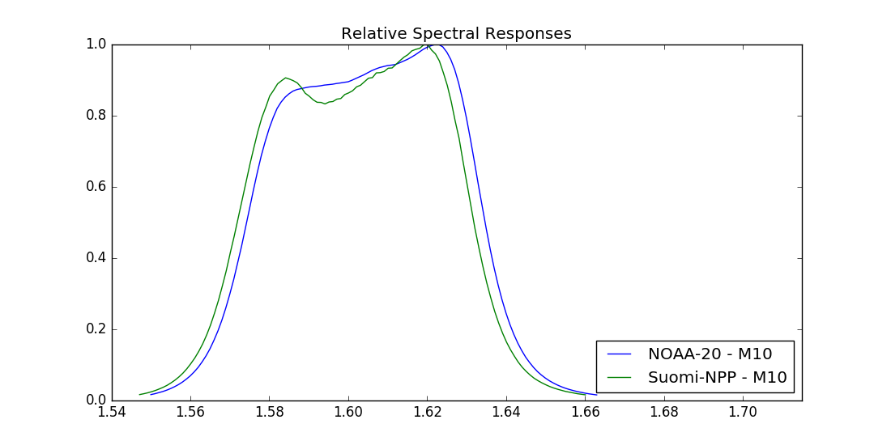
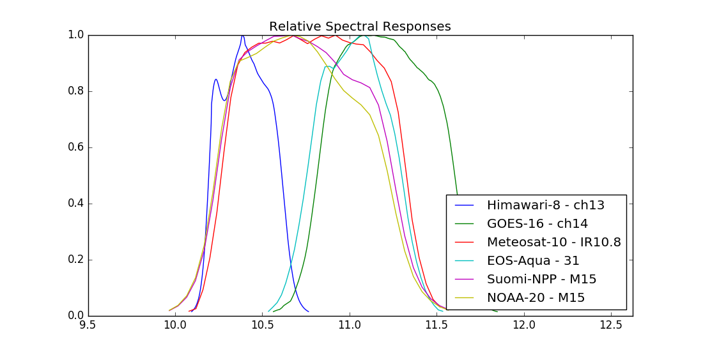
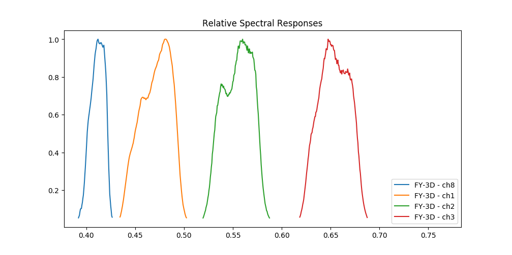

Simple plotting of spectral responses
-------------------------------------

Plot VIIRS spectral responses (detector 1 only) for band M10 on JPSS-1 and Suomi-NPP:

.. code::
   
   python composite_rsr_plot.py -p NOAA-20 Suomi-NPP -s viirs -b M10

           

Plot relative spectral responses for the spectral channel closest to the
:math:`10.8 \mu m`  for several platforms and sensors:

.. code::
   
   python composite_rsr_plot.py --platform_name Himawari-8 GOES-16 Meteosat-10 EOS-Aqua Sentinel-3A Suomi-NPP NOAA-20 --sensor ahi abi seviri modis olci slstr viirs --wavelength 10.8

Some sensor bands are quite close, and that requires the search for bands in
the spectral range to use rather small wavelengths increments. Therefore you
might experience the plotting to a bit slow on default. Here an example with
MERSI-2 on FY-3D:

.. code::
   
   python bin/composite_rsr_plot.py -p FY-3D -s mersi-2 -r 0.4 0.7 -t 0.05
           
.. image:: _static/mersi2_rsr_band_0040_0070.png

It is possible to specify a different wavelength resolution/increments by using
a flag. However, when you do that it might affect how pyspectral identify
bands. If the resolution is too coarse svereal close bands may be considered
one and the same. In the below case it is probably not a good idea to lower the
resolution as one can see (several MESI-2 bands are now missing):

.. code::
   
   python bin/composite_rsr_plot.py -p FY-3D -s mersi-2 -r 0.4 0.7 -t 0.05 --wavelength_resolution 0.05
           

