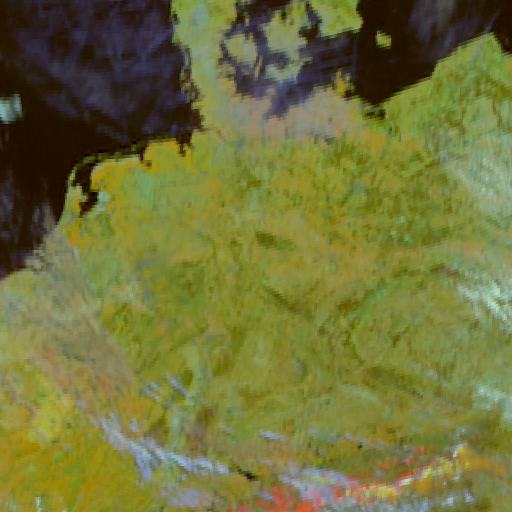

Example with SEVIRI data
------------------------

Let us try calculate the 3.9 micron reflectance for Meteosat-10:

.. doctest::

  >>> sunz = 80.
  >>> tb3 = 290.0
  >>> tb4 = 282.0
  >>> from pyspectral.near_infrared_reflectance import Calculator
  >>> refl39 = Calculator('Meteosat-10', 'seviri', 'IR3.9')
  >>> print('%4.3f' %refl39.reflectance_from_tbs(sunz, tb3, tb4))
  0.555

You can also provide the in-band solar flux from outside when calculating the
reflectance, saving a few milliseconds per call::

  >>> from pyspectral.solar import (SolarIrradianceSpectrum, TOTAL_IRRADIANCE_SPECTRUM_2000ASTM)
  >>> solar_irr = SolarIrradianceSpectrum(TOTAL_IRRADIANCE_SPECTRUM_2000ASTM, dlambda=0.0005)
  >>> from pyspectral.rsr_reader import RelativeSpectralResponse
  >>> seviri = RelativeSpectralResponse('Meteosat-10', 'seviri')
  >>> sflux = solar_irr.inband_solarflux(seviri.rsr['IR3.9'])
  >>> refl39 = Calculator('Meteosat-10', 'seviri', 'IR3.9', solar_flux=sflux)
  >>> print('%4.3f' %refl39.reflectance_from_tbs(sunz, tb3, tb4))
  0.555

Integration with MPOP
^^^^^^^^^^^^^^^^^^^^^
The mpop_ package integrates pyspectral_ so that it is very easy with only a
very few lines of code to make RGB images with the 3.9 reflectance as one of
the bands. Here we show you how this can be done using the built-in *snow* RGB
using the 0.8 micron, the 1.6 micron and the 3.9 micron reflectance derived
using pyspectral_:

  >>> from mpop.satellites import GeostationaryFactory
  >>> from datetime import datetime
  >>> from mpop.projector import get_area_def
  >>> europe = get_area_def("EuropeCanary")
  >>> tslot = datetime(2015, 4, 20, 10, 0)
  >>> glbd = GeostationaryFactory.create_scene("Meteosat-10", "", "seviri", tslot)
  >>> glbd.load(['VIS006', 'VIS008', 'IR_016', 'IR_039', 'IR_108', 'IR_134'], area_extent=europe.area_extent)
  >>> area = "germ"
  >>> lcd = glbd.project(area)
  >>> img = lcd.image.snow()
  >>> img.show()

The magic is all happening when calling *lcd.image.snow()* which use
*instruments/compositer.py* inside mpop_. If you want to customize your own RGB
using the r3.9 reflectance you can follow the example below. We will here need
pyorbital_ as well in order to get the sun zenith angles:

  >>> from mpop.satellites import GeostationaryFactory
  >>> from datetime import datetime
  >>> from mpop.projector import get_area_def
  >>> from mpop.imageo.geo_image import GeoImage
  >>> from pyorbital.astronomy import sun_zenith_angle as sza
  >>> import numpy as np
  >>> europe = get_area_def("EuropeCanary")
  >>> tslot = datetime(2015, 4, 20, 10, 0)
  >>> glbd = GeostationaryFactory.create_scene("Meteosat-10", "", "seviri", tslot)
  >>> glbd.load(area_extent=europe.area_extent)
  >>> area = "germ"
  >>> lcd = glbd.project(area)

So, now the data are loaded and remapped on the *germ* area, just as before,
and we can start getting the 3.9 micron reflectance and the sun zenith angles,
and then generate the RGB image:

  >>> r39 = lcd[3.9].get_reflectance(lcd[10.8].data, sun_zenith=None, tb13_4=lcd[13.4].data)
  >>> lonlats = lcd[3.9].area.get_lonlats()
  >>> sunz = sza(tslot, lonlats[0], lonlats[1])
  >>> sunz = np.ma.masked_outside(sunz, 0.0, 88.0)
  >>> sunzmask = sunz.mask
  >>> sunz = sunz.filled(88.)
  >>> costheta = np.cos(np.deg2rad(sunz))
  >>> red = np.ma.masked_where(sunzmask, lcd[0.8].data / costheta)
  >>> green = np.ma.masked_where(sunzmask, lcd[1.6].data / costheta)
  >>> img = GeoImage((red, green, r39 * 100), area, tslot, crange=((0, 100), (0, 70), (0, 30)), fill_value=(0, 0, 0), mode="RGB")
  >>> img.enhance(gamma=1.7)
  >>> img.show()

.. _pyspectral: http://github.com/pytroll/pyspectral
.. _mpop: http://www.github.com/pytroll/mpop
.. _pyorbital: http://www.github.com/pytroll/pyorbital
.. _`mpop documentation`: http://mpop.readthedocs.io/en/latest/
